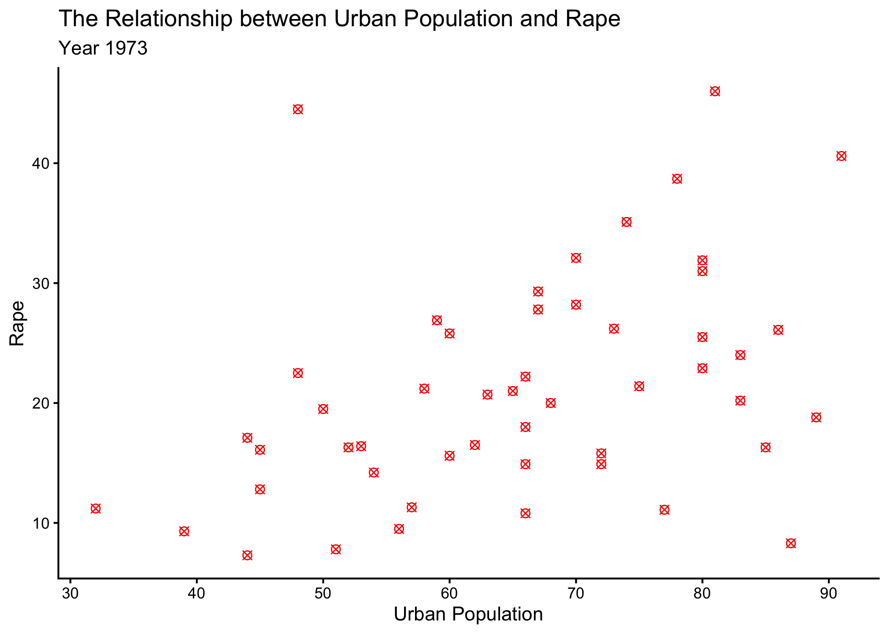
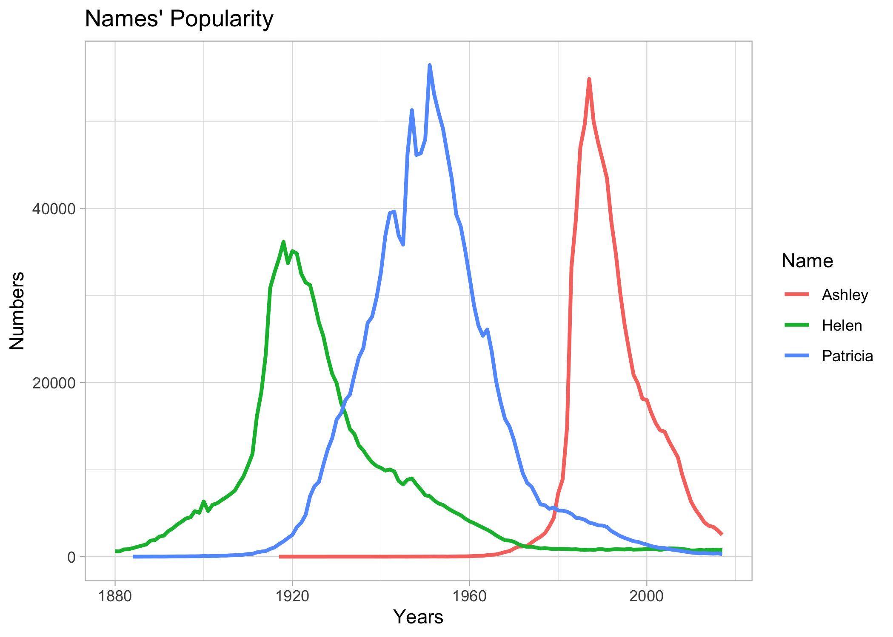

# Project 1: Exploratory Data Analysis in R

This project focuses on basic exploratory data analysis using R. The objective was to perform basic mathematic calculations and understand the dataset through visualizations created with ggplot2.

## Files
- `analysis.Rmd` – R Markdown file containing the analysis
- `plots/` – Generated visualizations

## Libraries Used
- readr
- ggplot2

## Database Used 
- USArrests
- names_popularity-1.csv

## Visualizations
### Data Analysis with Scatter Graph

### Data Analysis with Line Graph

## Summary
This project demonstrates fundamental data visualization techniques and data interpretation skills.

